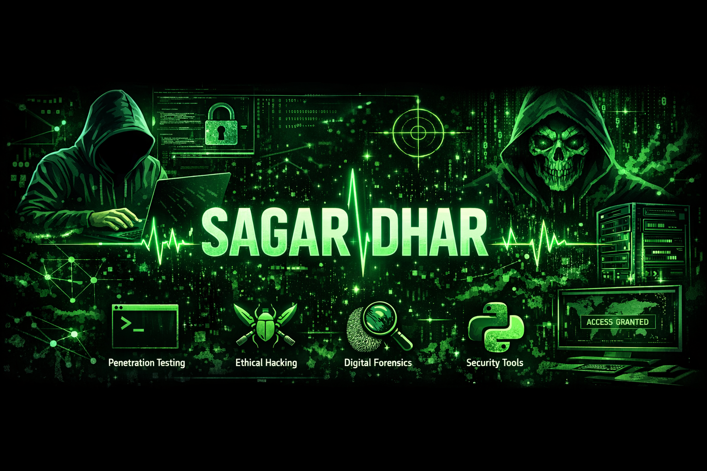

  

<h1 align="center">Hi 👋, I'm Sagar Dhar</h1>
<h3 align="center">Cybersecurity Enthusiast | Ethical Hacking Learner | Future Digital Forensics Specialist</h
---

## 🚀 About Me

🔐 Passionate about **Cybersecurity, Ethical Hacking, and Digital Forensics**

🎓 Currently studying **Cybersecurity & Ethical Hacking**

💻 Interested in building **security tools, scripts, and cybersecurity learning resources**

🌱 Currently learning:

* Network Security
* Ethical Hacking
* Kali Linux
* Penetration Testing
* Digital Forensics

---

## 🛠 Tools & Technologies

* Kali Linux
* Linux
* Python
* C
* C++
* Nmap
* Wireshark
* Burp Suite
* Metasploit
* HTML
* CSS
* JavaScript
* Microsoft Office
* AI Tools

---

## 📈 Programming Languages

* Python
* C
* C++
* HTML
* CSS
* JavaScript

---

## 📂 Cybersecurity Projects

* SQL Injection Scanner
* Nmap Automation Script
* Linux Security Scripts
* Cybersecurity Notes & Labs
* Kali Linux Command Cheatsheet

---

## 🎯 Goals for 2026

* Master Ethical Hacking
* Learn Digital Forensics
* Build multiple Cybersecurity Tools
* Contribute to Open Source Security Projects

---

## 🌐 Connect With Me

Instagram - https://www.instagram.com/sagar_____1934?igsh=MXIxOGd6dzRjczExMw==
LinkedIn  - https://www.linkedin.com/in/sagardhar040604?utm_source=share_via&utm_content=profile&utm_medium=member_android
---

